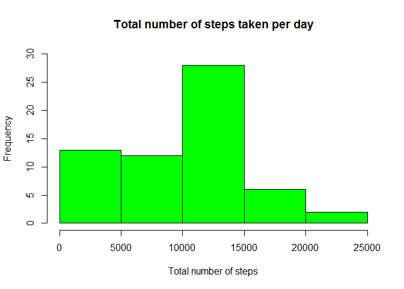
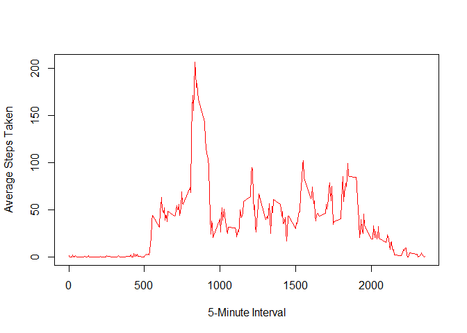
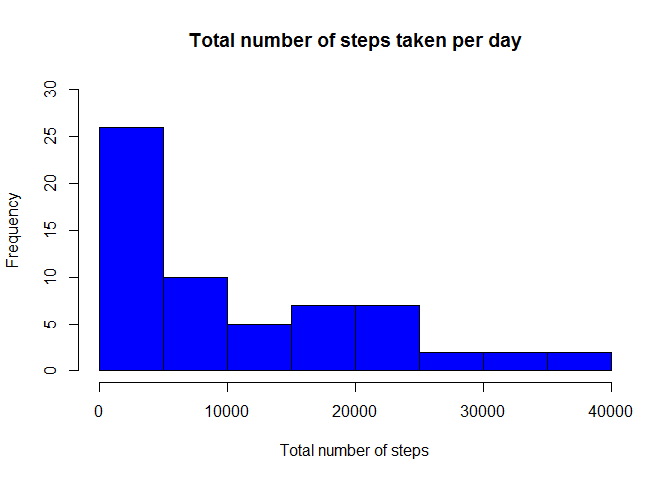
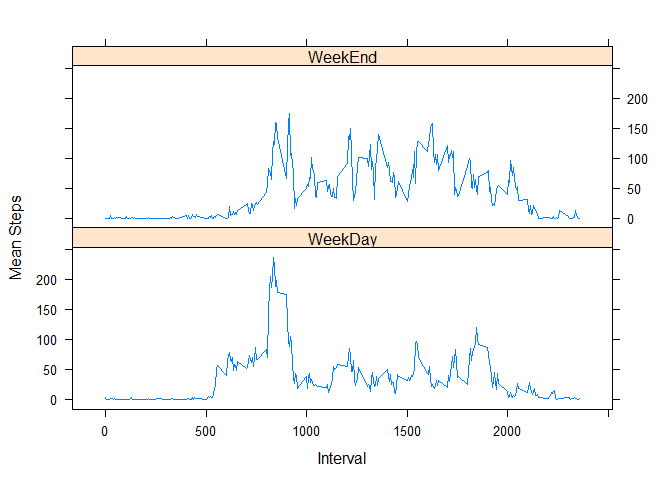

# Reproducible Research: Peer Assignment 1
Nicolas Michael  
Saturday, June 13, 2015  

## Report Background
The purpose of this report is to analyse a data set taken from an anonymous individual personal activity monitoring device.  
The data set contains the number of steps taken by that individual over a period of two months, October 2012 and November 2012, in 5 minute intervals per day.  
The original data set named "activity.csv" can be found in the repository where this report can be found.  
The data set consists of three (3) variables: steps, date and interval and 17,658 observations.  
Missing values (steps) are coded as NA.

## Report Objectives
The report will analyse the total number of steps taken by that individual during the reporting period, calculate the mean and
median number of steps, the average number of steps across the period, calculate the number of missing values and suggest a 
strategy for imputing missing data and finally analyse the difference in the average number of steps taken between  
weekdays and weekends.

## Loading the original data set
The code to load the data into R in order to initialise the data analysis is the following:


```r
ProjectData <- read.csv(unz("activity.zip", "activity.csv"))
```

## Histogram to show the total number of steps taken per day
First we need to calculate the number of steps use the following R code:


```r
TotalSteps <- aggregate(ProjectData$steps, by=list(ProjectData$date), FUN=sum, na.rm=TRUE)
```

Then print the histogram to show the total number of steps taken per day:


```r
hist(TotalSteps$x, main="Total number of steps taken per day", xlab="Total number of steps", col="Green", ylim=c(0,30))
```

 

## Mean and median of the total number of steps taken per day
First we need to remove the missing values from the original data set, by:


```r
CompleteProjectData <- ProjectData[complete.cases(ProjectData),]
```

Then calculate the mean and median from the revised data set using the following R code.
Please note the use of "xtable" package that needs to be installed on your machine for this code to run.

### Calculate mean:


```r
library(xtable)
MeanPerDay <- aggregate(CompleteProjectData$steps, by=list(CompleteProjectData$date), FUN=mean)
## Give meaningful names to the data frame generated
colnames(MeanPerDay) <- c("Date", "Steps")
MeanTable <- xtable(MeanPerDay, caption="Mean per day:")
print(MeanTable, type="html", include.rownames=FALSE, caption.placement="top")
```

<!-- html table generated in R 3.2.0 by xtable 1.7-4 package -->
<!-- Sun Jun 14 18:50:03 2015 -->
<table border=1>
<caption align="top"> Mean per day: </caption>
<tr> <th> Date </th> <th> Steps </th>  </tr>
  <tr> <td> 2012-10-02 </td> <td align="right"> 0.44 </td> </tr>
  <tr> <td> 2012-10-03 </td> <td align="right"> 39.42 </td> </tr>
  <tr> <td> 2012-10-04 </td> <td align="right"> 42.07 </td> </tr>
  <tr> <td> 2012-10-05 </td> <td align="right"> 46.16 </td> </tr>
  <tr> <td> 2012-10-06 </td> <td align="right"> 53.54 </td> </tr>
  <tr> <td> 2012-10-07 </td> <td align="right"> 38.25 </td> </tr>
  <tr> <td> 2012-10-09 </td> <td align="right"> 44.48 </td> </tr>
  <tr> <td> 2012-10-10 </td> <td align="right"> 34.38 </td> </tr>
  <tr> <td> 2012-10-11 </td> <td align="right"> 35.78 </td> </tr>
  <tr> <td> 2012-10-12 </td> <td align="right"> 60.35 </td> </tr>
  <tr> <td> 2012-10-13 </td> <td align="right"> 43.15 </td> </tr>
  <tr> <td> 2012-10-14 </td> <td align="right"> 52.42 </td> </tr>
  <tr> <td> 2012-10-15 </td> <td align="right"> 35.20 </td> </tr>
  <tr> <td> 2012-10-16 </td> <td align="right"> 52.38 </td> </tr>
  <tr> <td> 2012-10-17 </td> <td align="right"> 46.71 </td> </tr>
  <tr> <td> 2012-10-18 </td> <td align="right"> 34.92 </td> </tr>
  <tr> <td> 2012-10-19 </td> <td align="right"> 41.07 </td> </tr>
  <tr> <td> 2012-10-20 </td> <td align="right"> 36.09 </td> </tr>
  <tr> <td> 2012-10-21 </td> <td align="right"> 30.63 </td> </tr>
  <tr> <td> 2012-10-22 </td> <td align="right"> 46.74 </td> </tr>
  <tr> <td> 2012-10-23 </td> <td align="right"> 30.97 </td> </tr>
  <tr> <td> 2012-10-24 </td> <td align="right"> 29.01 </td> </tr>
  <tr> <td> 2012-10-25 </td> <td align="right"> 8.65 </td> </tr>
  <tr> <td> 2012-10-26 </td> <td align="right"> 23.53 </td> </tr>
  <tr> <td> 2012-10-27 </td> <td align="right"> 35.14 </td> </tr>
  <tr> <td> 2012-10-28 </td> <td align="right"> 39.78 </td> </tr>
  <tr> <td> 2012-10-29 </td> <td align="right"> 17.42 </td> </tr>
  <tr> <td> 2012-10-30 </td> <td align="right"> 34.09 </td> </tr>
  <tr> <td> 2012-10-31 </td> <td align="right"> 53.52 </td> </tr>
  <tr> <td> 2012-11-02 </td> <td align="right"> 36.81 </td> </tr>
  <tr> <td> 2012-11-03 </td> <td align="right"> 36.70 </td> </tr>
  <tr> <td> 2012-11-05 </td> <td align="right"> 36.25 </td> </tr>
  <tr> <td> 2012-11-06 </td> <td align="right"> 28.94 </td> </tr>
  <tr> <td> 2012-11-07 </td> <td align="right"> 44.73 </td> </tr>
  <tr> <td> 2012-11-08 </td> <td align="right"> 11.18 </td> </tr>
  <tr> <td> 2012-11-11 </td> <td align="right"> 43.78 </td> </tr>
  <tr> <td> 2012-11-12 </td> <td align="right"> 37.38 </td> </tr>
  <tr> <td> 2012-11-13 </td> <td align="right"> 25.47 </td> </tr>
  <tr> <td> 2012-11-15 </td> <td align="right"> 0.14 </td> </tr>
  <tr> <td> 2012-11-16 </td> <td align="right"> 18.89 </td> </tr>
  <tr> <td> 2012-11-17 </td> <td align="right"> 49.79 </td> </tr>
  <tr> <td> 2012-11-18 </td> <td align="right"> 52.47 </td> </tr>
  <tr> <td> 2012-11-19 </td> <td align="right"> 30.70 </td> </tr>
  <tr> <td> 2012-11-20 </td> <td align="right"> 15.53 </td> </tr>
  <tr> <td> 2012-11-21 </td> <td align="right"> 44.40 </td> </tr>
  <tr> <td> 2012-11-22 </td> <td align="right"> 70.93 </td> </tr>
  <tr> <td> 2012-11-23 </td> <td align="right"> 73.59 </td> </tr>
  <tr> <td> 2012-11-24 </td> <td align="right"> 50.27 </td> </tr>
  <tr> <td> 2012-11-25 </td> <td align="right"> 41.09 </td> </tr>
  <tr> <td> 2012-11-26 </td> <td align="right"> 38.76 </td> </tr>
  <tr> <td> 2012-11-27 </td> <td align="right"> 47.38 </td> </tr>
  <tr> <td> 2012-11-28 </td> <td align="right"> 35.36 </td> </tr>
  <tr> <td> 2012-11-29 </td> <td align="right"> 24.47 </td> </tr>
   </table>

### Calculate median:
In calculating the median we first need to eliminate the 5 minute intervals with zero steps.  
This is necessary for the median function to work correctly in dates where the first 5 minute
interval and the last 5 minute interval steps is zero.  


```r
library(xtable)
## Remove 5 minute intervals with zeros from the "CompleteProjectData" data frame
MedianData <- subset(CompleteProjectData, CompleteProjectData$steps >0)
MedianPerDay <- aggregate(MedianData$steps, by=list(MedianData$date), FUN=median)
## Give meaningful names to the data frame generated
colnames(MedianPerDay) <- c("Date", "Steps")
MedianTable <- xtable(MedianPerDay, caption="Median per day:")
print(MedianTable, type="html", include.rownames=FALSE, caption.placement="top")
```

<!-- html table generated in R 3.2.0 by xtable 1.7-4 package -->
<!-- Sun Jun 14 18:50:03 2015 -->
<table border=1>
<caption align="top"> Median per day: </caption>
<tr> <th> Date </th> <th> Steps </th>  </tr>
  <tr> <td> 2012-10-02 </td> <td align="right"> 63.00 </td> </tr>
  <tr> <td> 2012-10-03 </td> <td align="right"> 61.00 </td> </tr>
  <tr> <td> 2012-10-04 </td> <td align="right"> 56.50 </td> </tr>
  <tr> <td> 2012-10-05 </td> <td align="right"> 66.00 </td> </tr>
  <tr> <td> 2012-10-06 </td> <td align="right"> 67.00 </td> </tr>
  <tr> <td> 2012-10-07 </td> <td align="right"> 52.50 </td> </tr>
  <tr> <td> 2012-10-09 </td> <td align="right"> 48.00 </td> </tr>
  <tr> <td> 2012-10-10 </td> <td align="right"> 56.50 </td> </tr>
  <tr> <td> 2012-10-11 </td> <td align="right"> 35.00 </td> </tr>
  <tr> <td> 2012-10-12 </td> <td align="right"> 46.00 </td> </tr>
  <tr> <td> 2012-10-13 </td> <td align="right"> 45.50 </td> </tr>
  <tr> <td> 2012-10-14 </td> <td align="right"> 60.50 </td> </tr>
  <tr> <td> 2012-10-15 </td> <td align="right"> 54.00 </td> </tr>
  <tr> <td> 2012-10-16 </td> <td align="right"> 64.00 </td> </tr>
  <tr> <td> 2012-10-17 </td> <td align="right"> 61.50 </td> </tr>
  <tr> <td> 2012-10-18 </td> <td align="right"> 52.50 </td> </tr>
  <tr> <td> 2012-10-19 </td> <td align="right"> 74.00 </td> </tr>
  <tr> <td> 2012-10-20 </td> <td align="right"> 49.00 </td> </tr>
  <tr> <td> 2012-10-21 </td> <td align="right"> 48.00 </td> </tr>
  <tr> <td> 2012-10-22 </td> <td align="right"> 52.00 </td> </tr>
  <tr> <td> 2012-10-23 </td> <td align="right"> 56.00 </td> </tr>
  <tr> <td> 2012-10-24 </td> <td align="right"> 51.50 </td> </tr>
  <tr> <td> 2012-10-25 </td> <td align="right"> 35.00 </td> </tr>
  <tr> <td> 2012-10-26 </td> <td align="right"> 36.50 </td> </tr>
  <tr> <td> 2012-10-27 </td> <td align="right"> 72.00 </td> </tr>
  <tr> <td> 2012-10-28 </td> <td align="right"> 61.00 </td> </tr>
  <tr> <td> 2012-10-29 </td> <td align="right"> 54.50 </td> </tr>
  <tr> <td> 2012-10-30 </td> <td align="right"> 40.00 </td> </tr>
  <tr> <td> 2012-10-31 </td> <td align="right"> 83.50 </td> </tr>
  <tr> <td> 2012-11-02 </td> <td align="right"> 55.50 </td> </tr>
  <tr> <td> 2012-11-03 </td> <td align="right"> 59.00 </td> </tr>
  <tr> <td> 2012-11-05 </td> <td align="right"> 66.00 </td> </tr>
  <tr> <td> 2012-11-06 </td> <td align="right"> 52.00 </td> </tr>
  <tr> <td> 2012-11-07 </td> <td align="right"> 58.00 </td> </tr>
  <tr> <td> 2012-11-08 </td> <td align="right"> 42.50 </td> </tr>
  <tr> <td> 2012-11-11 </td> <td align="right"> 55.00 </td> </tr>
  <tr> <td> 2012-11-12 </td> <td align="right"> 42.00 </td> </tr>
  <tr> <td> 2012-11-13 </td> <td align="right"> 57.00 </td> </tr>
  <tr> <td> 2012-11-15 </td> <td align="right"> 20.50 </td> </tr>
  <tr> <td> 2012-11-16 </td> <td align="right"> 43.00 </td> </tr>
  <tr> <td> 2012-11-17 </td> <td align="right"> 65.50 </td> </tr>
  <tr> <td> 2012-11-18 </td> <td align="right"> 80.00 </td> </tr>
  <tr> <td> 2012-11-19 </td> <td align="right"> 34.00 </td> </tr>
  <tr> <td> 2012-11-20 </td> <td align="right"> 58.00 </td> </tr>
  <tr> <td> 2012-11-21 </td> <td align="right"> 55.00 </td> </tr>
  <tr> <td> 2012-11-22 </td> <td align="right"> 65.00 </td> </tr>
  <tr> <td> 2012-11-23 </td> <td align="right"> 113.00 </td> </tr>
  <tr> <td> 2012-11-24 </td> <td align="right"> 65.50 </td> </tr>
  <tr> <td> 2012-11-25 </td> <td align="right"> 84.00 </td> </tr>
  <tr> <td> 2012-11-26 </td> <td align="right"> 53.00 </td> </tr>
  <tr> <td> 2012-11-27 </td> <td align="right"> 57.00 </td> </tr>
  <tr> <td> 2012-11-28 </td> <td align="right"> 70.00 </td> </tr>
  <tr> <td> 2012-11-29 </td> <td align="right"> 44.50 </td> </tr>
   </table>

## Average Daily Activity Pattern
Then we calculate the average daily activity pattern averaged across all days and plot a time series plot to display the pattern.


```r
## Create a data frame to store the average number of steps across all days
AvgPerInterval <- aggregate(CompleteProjectData$steps, by=list(CompleteProjectData$interval), FUN=mean)
## Give meaningful names to the data frame generated
colnames(AvgPerInterval) <- c("Interval", "AvgSteps")
plot(AvgPerInterval$Interval, AvgPerInterval$AvgSteps, type="l", xlab="5-Minute Interval", ylab="Average Steps Taken", col="Red")
```

 

The 5-minute interval that has the maximum number of steps is:


```r
MaxInterval <- AvgPerInterval[order(-AvgPerInterval$AvgSteps), ]
MaxInterval[1,1]
```

[1] 835

## Strategy for imputting missing values
In the data set provided there are days or 5-minute intervals where values are missing.  The missing values could introduce some bias in the analysis because they could represent intervals with high activity where the individual did not carry the activity measure device.  On the other hand they could represent intervals with no activity at all.  This part of the report will suggest a  strategy for imputing the missing values, create a new data set with missing data filled in and estimate how this "complete" data set differs from the original data set used in the analysis.

To begin we need to calculate the total number of missing values in the original data set.  The number of missing values is:


```r
length(which(is.na(ProjectData$steps)))
```

[1] 2304

The number of missing values represents the 13% (2304/17568) of the original data set.

The author believes that the most appropriate way to impute the missing values is to calculate the mean per weekday (averaged across all days) per 5-minute interval.  To calculate the mean we need to introduce the weekday in the data frame named "CompleteProjectData", which stores all the complete cases.  Then create another data frame named "MeanWeekdayInterval" that will store the mean per weekday per 5-minute interval.  The code below is used to create the "MeanWeekdayInterval" data frame:


```r
## Add Weekday column in the data frame
CompleteProjectData$weekday <- weekdays(as.Date(CompleteProjectData$date))
## Create a new data frame to store the mean per weekday per interval
MeanWeekdayInterval <- with(CompleteProjectData, aggregate(steps, by=list(weekday, interval), FUN=mean))
## Give meaningful names to the data frame generated
colnames(MeanWeekdayInterval) <- c("weekday", "interval", "AvgSteps")
```

The next step is to merge the new data frame "MeanWeekdayInterval" with the original data frame "ProjectData" into a new data set named "ProjectDataFull".  The two data frames will be joined using the "merge" command using two columns the "weekday" and the "interval".  Please note that the column "weekday" does not exist in the original data set "ProjectData" so we need to add it before merging the two data frames.  The new data frame "ProjectDataFull" will consist of five (5) variables and 17,568 observations.  The variables are weekday, interval, steps (original), date, and the AvgSteps.  Another variable will be added to the data frame named "NewSteps" using the "ifelse" expression.  This expression will add to the new variable the steps and where it finds a "NA" it will adds the mean number of steps per weekday and interval.  This new variable "NewSteps" will provide the basis to analyse how the original data set differs from this new data set created.


```r
## Add Weekday column in the data frame
ProjectData$weekday <- weekdays(as.Date(ProjectData$date))
## Merge the two data frames into a new data frame
ProjectDataFull <- merge(ProjectData, MeanWeekdayInterval, by=c("weekday", "interval"))
## Create a new variable "NewSteps"
ProjectDataFull$NewSteps <- ifelse(is.na(ProjectDataFull$steps), ProjectDataFull$AvgSteps, ProjectDataFull$steps)
```

### Revised histogram to show the total number of steps taken per day after the replacement of missing values

First we need to calculate the number of steps (NewSteps) use the following R code:


```r
TotalStepsRevised <- aggregate(ProjectDataFull$NewSteps, by=list(ProjectData$date), FUN=sum, na.rm=TRUE)
```

The next step is to print the histogram to show the total number of steps(NewSteps) taken per day:


```r
hist(TotalStepsRevised$x, main="Total number of steps taken per day", xlab="Total number of steps", col="Blue", ylim=c(0,30))
```

 

Then we need to calculate the mean and median of this new data set and compare it against the original data set.

### Calculate revised mean


```r
NewMeanPerDay <- aggregate(ProjectDataFull$NewSteps, by=list(ProjectDataFull$date), FUN=mean)
## Give meaningful names to the data frame generated
colnames(NewMeanPerDay) <- c("Date", "Steps")
```

Then combine together the mean of the original data set with the mean of the full data set to enable easy comparisons.


```r
library(xtable)
CombinedDataSet <- merge(MeanPerDay, NewMeanPerDay, by="Date", all=TRUE)
MeanCombinedTable <- xtable(CombinedDataSet, caption="Mean comparison between the two data sets:")
## Give meaningful names to the data frame generated
colnames(MeanCombinedTable) <- c("Date", "OriginalMean", "NewMean")
print(MeanCombinedTable, type="html", include.rownames=FALSE, caption.placement="top")
```

<!-- html table generated in R 3.2.0 by xtable 1.7-4 package -->
<!-- Sun Jun 14 18:50:04 2015 -->
<table border=1>
<caption align="top"> Mean comparison between the two data sets: </caption>
<tr> <th> Date </th> <th> OriginalMean </th> <th> NewMean </th>  </tr>
  <tr> <td> 2012-10-01 </td> <td align="right">  </td> <td align="right"> 34.63 </td> </tr>
  <tr> <td> 2012-10-02 </td> <td align="right"> 0.44 </td> <td align="right"> 0.44 </td> </tr>
  <tr> <td> 2012-10-03 </td> <td align="right"> 39.42 </td> <td align="right"> 39.42 </td> </tr>
  <tr> <td> 2012-10-04 </td> <td align="right"> 42.07 </td> <td align="right"> 42.07 </td> </tr>
  <tr> <td> 2012-10-05 </td> <td align="right"> 46.16 </td> <td align="right"> 46.16 </td> </tr>
  <tr> <td> 2012-10-06 </td> <td align="right"> 53.54 </td> <td align="right"> 53.54 </td> </tr>
  <tr> <td> 2012-10-07 </td> <td align="right"> 38.25 </td> <td align="right"> 38.25 </td> </tr>
  <tr> <td> 2012-10-08 </td> <td align="right">  </td> <td align="right"> 34.63 </td> </tr>
  <tr> <td> 2012-10-09 </td> <td align="right"> 44.48 </td> <td align="right"> 44.48 </td> </tr>
  <tr> <td> 2012-10-10 </td> <td align="right"> 34.38 </td> <td align="right"> 34.38 </td> </tr>
  <tr> <td> 2012-10-11 </td> <td align="right"> 35.78 </td> <td align="right"> 35.78 </td> </tr>
  <tr> <td> 2012-10-12 </td> <td align="right"> 60.35 </td> <td align="right"> 60.35 </td> </tr>
  <tr> <td> 2012-10-13 </td> <td align="right"> 43.15 </td> <td align="right"> 43.15 </td> </tr>
  <tr> <td> 2012-10-14 </td> <td align="right"> 52.42 </td> <td align="right"> 52.42 </td> </tr>
  <tr> <td> 2012-10-15 </td> <td align="right"> 35.20 </td> <td align="right"> 35.20 </td> </tr>
  <tr> <td> 2012-10-16 </td> <td align="right"> 52.38 </td> <td align="right"> 52.38 </td> </tr>
  <tr> <td> 2012-10-17 </td> <td align="right"> 46.71 </td> <td align="right"> 46.71 </td> </tr>
  <tr> <td> 2012-10-18 </td> <td align="right"> 34.92 </td> <td align="right"> 34.92 </td> </tr>
  <tr> <td> 2012-10-19 </td> <td align="right"> 41.07 </td> <td align="right"> 41.07 </td> </tr>
  <tr> <td> 2012-10-20 </td> <td align="right"> 36.09 </td> <td align="right"> 36.09 </td> </tr>
  <tr> <td> 2012-10-21 </td> <td align="right"> 30.63 </td> <td align="right"> 30.63 </td> </tr>
  <tr> <td> 2012-10-22 </td> <td align="right"> 46.74 </td> <td align="right"> 46.74 </td> </tr>
  <tr> <td> 2012-10-23 </td> <td align="right"> 30.97 </td> <td align="right"> 30.97 </td> </tr>
  <tr> <td> 2012-10-24 </td> <td align="right"> 29.01 </td> <td align="right"> 29.01 </td> </tr>
  <tr> <td> 2012-10-25 </td> <td align="right"> 8.65 </td> <td align="right"> 8.65 </td> </tr>
  <tr> <td> 2012-10-26 </td> <td align="right"> 23.53 </td> <td align="right"> 23.53 </td> </tr>
  <tr> <td> 2012-10-27 </td> <td align="right"> 35.14 </td> <td align="right"> 35.14 </td> </tr>
  <tr> <td> 2012-10-28 </td> <td align="right"> 39.78 </td> <td align="right"> 39.78 </td> </tr>
  <tr> <td> 2012-10-29 </td> <td align="right"> 17.42 </td> <td align="right"> 17.42 </td> </tr>
  <tr> <td> 2012-10-30 </td> <td align="right"> 34.09 </td> <td align="right"> 34.09 </td> </tr>
  <tr> <td> 2012-10-31 </td> <td align="right"> 53.52 </td> <td align="right"> 53.52 </td> </tr>
  <tr> <td> 2012-11-01 </td> <td align="right">  </td> <td align="right"> 28.52 </td> </tr>
  <tr> <td> 2012-11-02 </td> <td align="right"> 36.81 </td> <td align="right"> 36.81 </td> </tr>
  <tr> <td> 2012-11-03 </td> <td align="right"> 36.70 </td> <td align="right"> 36.70 </td> </tr>
  <tr> <td> 2012-11-04 </td> <td align="right">  </td> <td align="right"> 42.63 </td> </tr>
  <tr> <td> 2012-11-05 </td> <td align="right"> 36.25 </td> <td align="right"> 36.25 </td> </tr>
  <tr> <td> 2012-11-06 </td> <td align="right"> 28.94 </td> <td align="right"> 28.94 </td> </tr>
  <tr> <td> 2012-11-07 </td> <td align="right"> 44.73 </td> <td align="right"> 44.73 </td> </tr>
  <tr> <td> 2012-11-08 </td> <td align="right"> 11.18 </td> <td align="right"> 11.18 </td> </tr>
  <tr> <td> 2012-11-09 </td> <td align="right">  </td> <td align="right"> 42.92 </td> </tr>
  <tr> <td> 2012-11-10 </td> <td align="right">  </td> <td align="right"> 43.53 </td> </tr>
  <tr> <td> 2012-11-11 </td> <td align="right"> 43.78 </td> <td align="right"> 43.78 </td> </tr>
  <tr> <td> 2012-11-12 </td> <td align="right"> 37.38 </td> <td align="right"> 37.38 </td> </tr>
  <tr> <td> 2012-11-13 </td> <td align="right"> 25.47 </td> <td align="right"> 25.47 </td> </tr>
  <tr> <td> 2012-11-14 </td> <td align="right">  </td> <td align="right"> 40.94 </td> </tr>
  <tr> <td> 2012-11-15 </td> <td align="right"> 0.14 </td> <td align="right"> 0.14 </td> </tr>
  <tr> <td> 2012-11-16 </td> <td align="right"> 18.89 </td> <td align="right"> 18.89 </td> </tr>
  <tr> <td> 2012-11-17 </td> <td align="right"> 49.79 </td> <td align="right"> 49.79 </td> </tr>
  <tr> <td> 2012-11-18 </td> <td align="right"> 52.47 </td> <td align="right"> 52.47 </td> </tr>
  <tr> <td> 2012-11-19 </td> <td align="right"> 30.70 </td> <td align="right"> 30.70 </td> </tr>
  <tr> <td> 2012-11-20 </td> <td align="right"> 15.53 </td> <td align="right"> 15.53 </td> </tr>
  <tr> <td> 2012-11-21 </td> <td align="right"> 44.40 </td> <td align="right"> 44.40 </td> </tr>
  <tr> <td> 2012-11-22 </td> <td align="right"> 70.93 </td> <td align="right"> 70.93 </td> </tr>
  <tr> <td> 2012-11-23 </td> <td align="right"> 73.59 </td> <td align="right"> 73.59 </td> </tr>
  <tr> <td> 2012-11-24 </td> <td align="right"> 50.27 </td> <td align="right"> 50.27 </td> </tr>
  <tr> <td> 2012-11-25 </td> <td align="right"> 41.09 </td> <td align="right"> 41.09 </td> </tr>
  <tr> <td> 2012-11-26 </td> <td align="right"> 38.76 </td> <td align="right"> 38.76 </td> </tr>
  <tr> <td> 2012-11-27 </td> <td align="right"> 47.38 </td> <td align="right"> 47.38 </td> </tr>
  <tr> <td> 2012-11-28 </td> <td align="right"> 35.36 </td> <td align="right"> 35.36 </td> </tr>
  <tr> <td> 2012-11-29 </td> <td align="right"> 24.47 </td> <td align="right"> 24.47 </td> </tr>
  <tr> <td> 2012-11-30 </td> <td align="right">  </td> <td align="right"> 42.92 </td> </tr>
   </table>

### Calculate revised median
In calculating the revised median we first need to eliminate the 5 minute intervals with zero steps.  
This is necessary for the median function to work correctly in dates where the first 5 minute
interval and the last 5 minute interval steps is zero.  


```r
## Remove 5 minute intervals with zeros from the "ProjectDataFull" data frame
NewMedianData <- subset(ProjectDataFull, ProjectDataFull$NewSteps >0)
NewMedianPerDay <- aggregate(NewMedianData$NewSteps, by=list(NewMedianData$date), FUN=median)
## Give meaningful names to the data frame generated
colnames(NewMedianPerDay) <- c("Date", "Steps")
```

Then combine together the median of the original data set with the median of the full data set to enable easy comparisons.


```r
library(xtable)
CombinedDataSet <- merge(MedianPerDay, NewMedianPerDay, by="Date", all=TRUE)
MedianCombinedTable <- xtable(CombinedDataSet, caption="Median comparison between the two data sets:")
## Give meaningful names to the data frame generated
colnames(MedianCombinedTable) <- c("Date", "OriginalMedian", "NewMedian")
print(MedianCombinedTable, type="html", include.rownames=FALSE, caption.placement="top")
```

<!-- html table generated in R 3.2.0 by xtable 1.7-4 package -->
<!-- Sun Jun 14 18:50:04 2015 -->
<table border=1>
<caption align="top"> Median comparison between the two data sets: </caption>
<tr> <th> Date </th> <th> OriginalMedian </th> <th> NewMedian </th>  </tr>
  <tr> <td> 2012-10-01 </td> <td align="right">  </td> <td align="right"> 24.71 </td> </tr>
  <tr> <td> 2012-10-02 </td> <td align="right"> 63.00 </td> <td align="right"> 63.00 </td> </tr>
  <tr> <td> 2012-10-03 </td> <td align="right"> 61.00 </td> <td align="right"> 61.00 </td> </tr>
  <tr> <td> 2012-10-04 </td> <td align="right"> 56.50 </td> <td align="right"> 56.50 </td> </tr>
  <tr> <td> 2012-10-05 </td> <td align="right"> 66.00 </td> <td align="right"> 66.00 </td> </tr>
  <tr> <td> 2012-10-06 </td> <td align="right"> 67.00 </td> <td align="right"> 67.00 </td> </tr>
  <tr> <td> 2012-10-07 </td> <td align="right"> 52.50 </td> <td align="right"> 52.50 </td> </tr>
  <tr> <td> 2012-10-08 </td> <td align="right">  </td> <td align="right"> 24.71 </td> </tr>
  <tr> <td> 2012-10-09 </td> <td align="right"> 48.00 </td> <td align="right"> 48.00 </td> </tr>
  <tr> <td> 2012-10-10 </td> <td align="right"> 56.50 </td> <td align="right"> 56.50 </td> </tr>
  <tr> <td> 2012-10-11 </td> <td align="right"> 35.00 </td> <td align="right"> 35.00 </td> </tr>
  <tr> <td> 2012-10-12 </td> <td align="right"> 46.00 </td> <td align="right"> 46.00 </td> </tr>
  <tr> <td> 2012-10-13 </td> <td align="right"> 45.50 </td> <td align="right"> 45.50 </td> </tr>
  <tr> <td> 2012-10-14 </td> <td align="right"> 60.50 </td> <td align="right"> 60.50 </td> </tr>
  <tr> <td> 2012-10-15 </td> <td align="right"> 54.00 </td> <td align="right"> 54.00 </td> </tr>
  <tr> <td> 2012-10-16 </td> <td align="right"> 64.00 </td> <td align="right"> 64.00 </td> </tr>
  <tr> <td> 2012-10-17 </td> <td align="right"> 61.50 </td> <td align="right"> 61.50 </td> </tr>
  <tr> <td> 2012-10-18 </td> <td align="right"> 52.50 </td> <td align="right"> 52.50 </td> </tr>
  <tr> <td> 2012-10-19 </td> <td align="right"> 74.00 </td> <td align="right"> 74.00 </td> </tr>
  <tr> <td> 2012-10-20 </td> <td align="right"> 49.00 </td> <td align="right"> 49.00 </td> </tr>
  <tr> <td> 2012-10-21 </td> <td align="right"> 48.00 </td> <td align="right"> 48.00 </td> </tr>
  <tr> <td> 2012-10-22 </td> <td align="right"> 52.00 </td> <td align="right"> 52.00 </td> </tr>
  <tr> <td> 2012-10-23 </td> <td align="right"> 56.00 </td> <td align="right"> 56.00 </td> </tr>
  <tr> <td> 2012-10-24 </td> <td align="right"> 51.50 </td> <td align="right"> 51.50 </td> </tr>
  <tr> <td> 2012-10-25 </td> <td align="right"> 35.00 </td> <td align="right"> 35.00 </td> </tr>
  <tr> <td> 2012-10-26 </td> <td align="right"> 36.50 </td> <td align="right"> 36.50 </td> </tr>
  <tr> <td> 2012-10-27 </td> <td align="right"> 72.00 </td> <td align="right"> 72.00 </td> </tr>
  <tr> <td> 2012-10-28 </td> <td align="right"> 61.00 </td> <td align="right"> 61.00 </td> </tr>
  <tr> <td> 2012-10-29 </td> <td align="right"> 54.50 </td> <td align="right"> 54.50 </td> </tr>
  <tr> <td> 2012-10-30 </td> <td align="right"> 40.00 </td> <td align="right"> 40.00 </td> </tr>
  <tr> <td> 2012-10-31 </td> <td align="right"> 83.50 </td> <td align="right"> 83.50 </td> </tr>
  <tr> <td> 2012-11-01 </td> <td align="right">  </td> <td align="right"> 15.12 </td> </tr>
  <tr> <td> 2012-11-02 </td> <td align="right"> 55.50 </td> <td align="right"> 55.50 </td> </tr>
  <tr> <td> 2012-11-03 </td> <td align="right"> 59.00 </td> <td align="right"> 59.00 </td> </tr>
  <tr> <td> 2012-11-04 </td> <td align="right">  </td> <td align="right"> 45.00 </td> </tr>
  <tr> <td> 2012-11-05 </td> <td align="right"> 66.00 </td> <td align="right"> 66.00 </td> </tr>
  <tr> <td> 2012-11-06 </td> <td align="right"> 52.00 </td> <td align="right"> 52.00 </td> </tr>
  <tr> <td> 2012-11-07 </td> <td align="right"> 58.00 </td> <td align="right"> 58.00 </td> </tr>
  <tr> <td> 2012-11-08 </td> <td align="right"> 42.50 </td> <td align="right"> 42.50 </td> </tr>
  <tr> <td> 2012-11-09 </td> <td align="right">  </td> <td align="right"> 30.07 </td> </tr>
  <tr> <td> 2012-11-10 </td> <td align="right">  </td> <td align="right"> 39.29 </td> </tr>
  <tr> <td> 2012-11-11 </td> <td align="right"> 55.00 </td> <td align="right"> 55.00 </td> </tr>
  <tr> <td> 2012-11-12 </td> <td align="right"> 42.00 </td> <td align="right"> 42.00 </td> </tr>
  <tr> <td> 2012-11-13 </td> <td align="right"> 57.00 </td> <td align="right"> 57.00 </td> </tr>
  <tr> <td> 2012-11-14 </td> <td align="right">  </td> <td align="right"> 25.69 </td> </tr>
  <tr> <td> 2012-11-15 </td> <td align="right"> 20.50 </td> <td align="right"> 20.50 </td> </tr>
  <tr> <td> 2012-11-16 </td> <td align="right"> 43.00 </td> <td align="right"> 43.00 </td> </tr>
  <tr> <td> 2012-11-17 </td> <td align="right"> 65.50 </td> <td align="right"> 65.50 </td> </tr>
  <tr> <td> 2012-11-18 </td> <td align="right"> 80.00 </td> <td align="right"> 80.00 </td> </tr>
  <tr> <td> 2012-11-19 </td> <td align="right"> 34.00 </td> <td align="right"> 34.00 </td> </tr>
  <tr> <td> 2012-11-20 </td> <td align="right"> 58.00 </td> <td align="right"> 58.00 </td> </tr>
  <tr> <td> 2012-11-21 </td> <td align="right"> 55.00 </td> <td align="right"> 55.00 </td> </tr>
  <tr> <td> 2012-11-22 </td> <td align="right"> 65.00 </td> <td align="right"> 65.00 </td> </tr>
  <tr> <td> 2012-11-23 </td> <td align="right"> 113.00 </td> <td align="right"> 113.00 </td> </tr>
  <tr> <td> 2012-11-24 </td> <td align="right"> 65.50 </td> <td align="right"> 65.50 </td> </tr>
  <tr> <td> 2012-11-25 </td> <td align="right"> 84.00 </td> <td align="right"> 84.00 </td> </tr>
  <tr> <td> 2012-11-26 </td> <td align="right"> 53.00 </td> <td align="right"> 53.00 </td> </tr>
  <tr> <td> 2012-11-27 </td> <td align="right"> 57.00 </td> <td align="right"> 57.00 </td> </tr>
  <tr> <td> 2012-11-28 </td> <td align="right"> 70.00 </td> <td align="right"> 70.00 </td> </tr>
  <tr> <td> 2012-11-29 </td> <td align="right"> 44.50 </td> <td align="right"> 44.50 </td> </tr>
  <tr> <td> 2012-11-30 </td> <td align="right">  </td> <td align="right"> 30.07 </td> </tr>
   </table>

### Impact of imputing missing data
The impact of imputing missing data into the original set is that new dates we introduced in the data set.  These new dates were completely missing from the original data set.  However in the dates that were both present in the original data set and the new data set the mean and median remained the same.

## Differences in activity patterns between weekdays and weekends
The differences in activity patterns between weekdays and weekends will be based on the "ProjectDataFull" data frame, i.e. the new data frame created to impute the missing data.  We need to create another factor variable named "DayFlag" to categorise the data between weekdays (DayFlag="WeekDay") and weekends (DayFlag="WeekENd").


```r
ProjectDataFull$DayFlag <- with(ProjectDataFull, ifelse(weekday=="Saturday" | weekday=="Sunday", "WeekEnd", "WeekDay"))
```

Then based on the new factor variable we will create two new data frames to calculate the mean of the steps during weekdays and weekends.


```r
WeekDayMeanData <- ProjectDataFull[ProjectDataFull$DayFlag=="WeekDay", ]
WeekEndMeanData <- ProjectDataFull[ProjectDataFull$DayFlag=="WeekEnd", ]
```

Based on the new data frames we calculate the mean per interval and day flag.


```r
WeekDayMean <- with(WeekDayMeanData, aggregate(NewSteps, by=list(DayFlag, interval), FUN=mean))
## Give meaningful names to the data frame generated
colnames(WeekDayMean) <- c("DayFlag", "Interval", "MeanSteps")
WeekEndMean <- with(WeekEndMeanData, aggregate(NewSteps, by=list(DayFlag, interval), FUN=mean))
## Give meaningful names to the data frame generated
colnames(WeekEndMean) <- c("DayFlag", "Interval", "MeanSteps")
```

The next step is to create one data frame to combine the results.


```r
CombinedMeanData <- rbind(WeekDayMean, WeekEndMean)
```

Finally plot a panel plot chart displaying the mean steps per interval per day flag (weekday or weekend).  
This plot is based on the lattice system, make sure that is installed on your machine before trying to reproduce it.


```r
library(lattice)
xyplot(MeanSteps~Interval|DayFlag, data=CombinedMeanData, type="l", xlab="Interval", ylab="Mean Steps", layout=c(1,2) )
```

 
